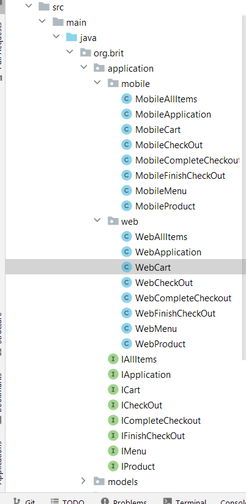

# Framework example for running tests on different environments

## Problem
Lets imagine that we need to run the same tests, for example, on web and mobile. 
There are several solutions for this:
* Develop 2 different solutions for this. One for web and another for mobile.
* One solution. Try to play around locators and many "ifs".
* One solution, but use interfaces and different implementations for them.

Lets talk about the last one approach.

## Note
This is just an example. Some functionality may not work properly.

## What we will use
* WebApp: [Souce demo](https://www.saucedemo.com)
* Mobile App: [Souce mobile app](https://github.com/saucelabs/sample-app-mobile/releases/download/2.7.1/Android.SauceLabs.Mobile.Sample.app.2.7.1.apk)

This is simple shop with simple functionality.

## What user can do in shop
Lets get all **big** steps that user can do with application:

* Login
* Main page:
  * Add product to cart
  * Remove product from cart
  * Sort products
  * Go to product
  * Get numbers of product that are in cart
* Product page:
  * Get info about product
  * Back to Main page
  * Add product to cart
  * Remove product from cart
* Cart Page
  * Remove product from cart
  * Begin Checkout process
  * Return to Main page
* Checkout process. This is like a Wizard with many pages
  * Insert info about buyer
  * Get info about the order(prices, total price etc.)
  * Finish checkout process

So as you can see there are many abstract steps regardless of where these steps are doing: On Web or Mobile

## Lets create interfaces
Now we can create interfaces to describe all this steps for different parts of application.
Fo example for [Cart steps](src/main/java/org/brit/application/ICart.java)

```java
public interface ICart extends IApplication{
    IAllItems continueShopping();
    List<ProductItem> getAllItemsInCart();
    ICart removeItemFromCart(String cartName);
    ICheckOut checkout();
}
```
``IAllItems, ProductItem,  ICheckOut  etc.`` - classes similar to ICart

## Lets create implementations for this interfaces
For example for Web app ICart will be something like this:
```java
public class WebCart extends WebApplication implements ICart {
    CartPage cartPage = new CartPage();

    @Override
    public IAllItems continueShopping() {
        cartPage.continueShopping();
        return new WebAllItems();
    }

    @Override
    public List<ProductItem> getAllItemsInCart() {
        return cartPage.getProductItemsList();
    }

    @Override
    public ICart removeItemFromCart(String productName) {
        cartPage.removeProductFromCart(productName);
        return this;
    }

    @Override
    public ICheckOut checkout() {
        cartPage.checkout();
        return new WebCheckOut();
    }
}
```
``CartPage`` - this is page for Web application with its own functionality. The same one we will create for the Mobile app


The structure will be like:



## Additional classes
In this project I use:
* [App Factory](src/main/java/org/brit/webdriver/AppFactory.java) to init application
* [Android driver provider](src/main/java/org/brit/webdriver/AndroidDriverProvider.java) this is approach for init android driver with Selenide
* Different POJOs and support classes

## Tests
Now lets take a look on tests.
* **Base test class**
```java
    public IApplication application;

    @BeforeClass
    public void beforeSuite(){
        application = AppFactory.initApp();
    }
```
As you can see I use ``IApplication`` interface. Depending on environment you will get corresponding instance
**See [App Factory](src/main/java/org/brit/webdriver/AppFactory.java)**

The test itself:
```java
public class CartTests extends BaseTest {

    @Test
    public void addItemToCartTest() {
        String itemName = "Sauce Labs Backpack";
        Integer productsCountInCart = application
                .goToApp()
                .login("standard_user", "secret_sauce")
                .addProductToCart(itemName)
                .getProductsCountInCart();

        assertThat(productsCountInCart).isEqualTo(1);

        ICart iCart = application.goToCart();
        ProductItem productItem = iCart
                .getAllItemsInCart()
                .get(0);

        assertThat(productItem.itemName())
                .isEqualTo(itemName);
        iCart
                .checkout()
                .enterInfoForCheckout("some", "some", "Some")
                .continueCheckOut()
                .finish()
                .goToItems()
                .openMenu()
                .logout();
    }
}
```
So as you can see tests do not depend on environment.

## Instructions how to run tests
* Run on web env: 

  ```mvn clean -DwhereToRun=web test```

   OR

  ```mvn clean -DwhereToRun=web -Dtest=* test```
* For mobile:
  * Download and install [Appium server](https://appium.io/)
  * Download and install [Android studio](https://developer.android.com/studio) and install android SDK and create Emulator for tests. I installed Android 11 sdk (x86_64) and create emulator using this sdk(Pixel_4_API_30)
  * Run Appium server
  * Run newly created emulator

## Last Notes
This is just an example!!!!
